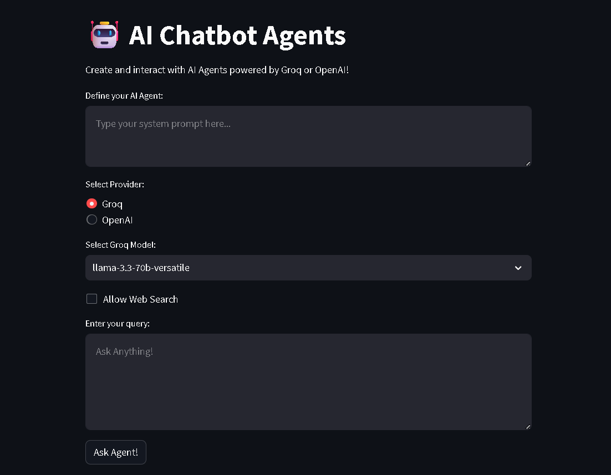
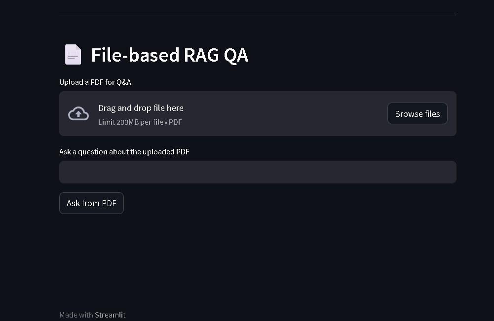

# 🧠 AI Agent Chatbot + PDF RAG

This project is an AI-powered assistant that supports both:
- 📚 RAG (Retrieval-Augmented Generation) from uploaded PDFs
- 🤖 Agent-based chat using Groq or OpenAI models

## 🚀 Features
- Upload a PDF and ask questions from it (RAG)
- Choose AI models like `LLaMA-3`, `Mixtral`, or `GPT-4o-mini`
- Supports web search toggle (if implemented in backend)
- Built with FastAPI + Streamlit

## 🖼 Interface Preview






## 🧩 Project Structure
```
📁 ai_agent_fastapi_groq_streamlit
├── backend.py         # FastAPI backend with /chat, /upload, /ask_rag
├── frontend.py        # Streamlit frontend UI
├── ai_agent.py        # Handles generic model-based responses
├── rag_engine.py      # Embeds and searches PDF content
├── utils_rag.py       # Query Groq with context prompt
├── .env               # Contains GROQ_API_KEY and other secrets
├── requirements.txt   # Python dependencies
```

## 📦 Installation

1. Clone the repo and move into it:

```bash
git clone https://github.com/Sibuninja/ai_agent_fastapi_groq_streamlit.git
cd ai_agent_fastapi_groq_streamlit
```

2. Create virtual environment and activate:

```bash
python -m venv venv
venv\Scripts\activate
```

3. Install dependencies:

```bash
pip install -r requirements.txt
```

4. Create a `.env` file with your keys:

```
GROQ_API_KEY=your_groq_api_key_here
OPENAI_API_KEY=your_openai_key_here  # if used
```

## ▶️ Run

Start backend:
```bash
uvicorn backend:app --reload --port 9999
```

Start frontend:
```bash
streamlit run frontend.py
```

---

## 🛡️ Notes
- Don't commit your `.env` or `venv/` folder.
- Avoid pushing large files like `.dll`, `.lib`, or model weights.